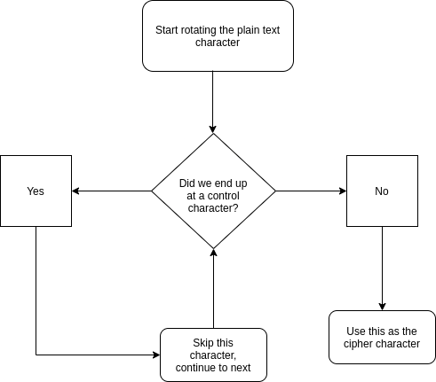

# Ancient Crypto for Zoomers!

In the old old days, the Caesar cipher did not support such advanced formats as UTF32, where any and all characters are included and welcome - even a millenia and a half (and a bit more) later, the more advanced, Vigenere version of the cipher also was at loss for words when it came to UTF32.

In fact, uttering such words might have gotten one burnt as a stake, as a heretic.

In the 21st century, though, with such high level technologies such as C# and the UTF32 table, as well as the infinite source of knowledge that is Google, I was able to implement a system where such cryptic strings as "I think 🤔 therefore I am  😎" could be, using "🙊🙉🙈 No evil" as a key, encoded into such unintelligible strings as "🺴🺊🻝©Øþ¬¦🦊ªā🻓🻏🻛¦Õÿ³ë·Ó­🻌🻗🺉@🙜"

It's a simple console application, with all the instructions written at runtime.

## How to run

If on Linux, `xsel` is required as a dependency for the copy command to work.
To run it on your own machine, in the project directory, execute:

```
dotnet run
```

To run it in docker:

```
docker build -t hw1_damshv .
docker run -it hw1_damshv
```

## The why

Because I can

## The how

When dealing with UTF32, there are two types of bumps on the road - surrogate bytes and control characters.
Surrogate bytes are well known, their range is from 0xd800 to 0xdfff.
Unlike ASCII, where the control characters are at the start, in UTF32 the control characters are everywhere, and making the program know where each and every one of them is, is a nightmare. Instead of being aware of the control characters, this program just skips them all together, and, to the surprise of some, can regenerate the plaintext correctly. The following is the algorithm:



It looks pretty simple, but figuring out that control chars are everywhere took a test run of the code, and looking at the UTF table (a lot).

## Concerns

Some utf characters don't like to be copied correctly, hence the **copy** functionality in the application. Alas, it didn't work as intended - to make it work, only option that had a chance was to run an ssh server in the machine, and make the user ssh into the machine... too much headache.

This, however, can be implemented in a much better way as a web application using js.